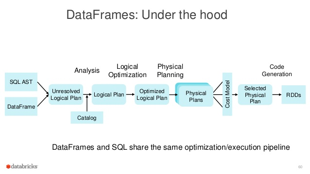
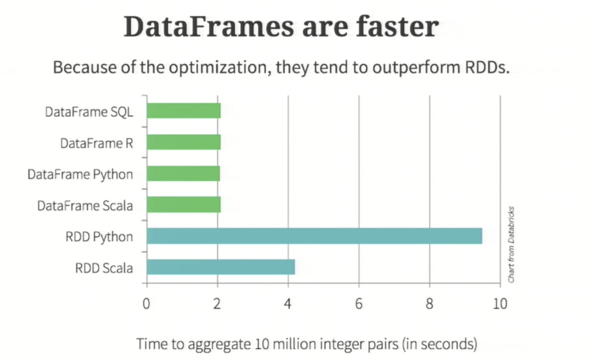

DataFrame API
=============

* higher level of abstraction than RDDs 
* DSL format
* much easier to read 
    ```
     val df = parsedRDD.toDF("project","numRequests")
     df.groupBy($"page")
       .agg(sum($"numRequests").as("count"))
       .limit(100)
       .show(100)
   ```

* is optimised 
   ```
      users.join(events, users("id") === events("uid"))
       .filter(events("date") > "2015-01-01"
   ```
   this is optimised so that filter happens first

* under the hood
  

* Push downs with intelligent data sources done by CATALYST
   With the likes of parquet or postgres or other RDBMS systems, 
     the predicate can be pushed down to the DB/file itself
     
* faster     
   
   
* BUT NOT TYPE SAFE
   everything is a `org.apache.spark.sql.Row`