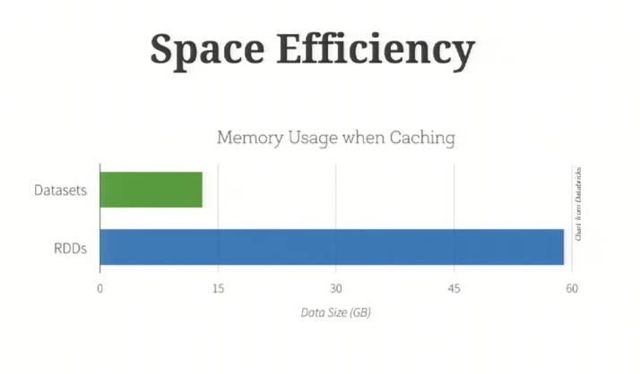
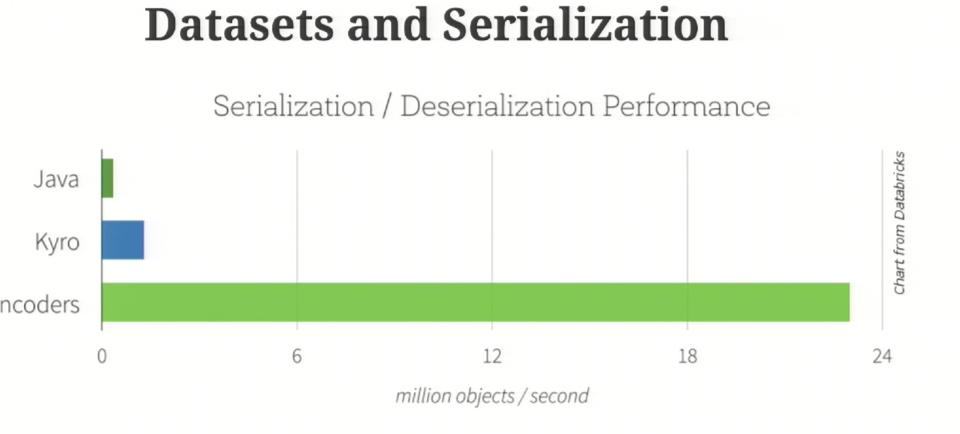

DataSet
=======

* extension of DataFrame
* typed
* DataFrame = DataSet[Row]
* conceptually similar to RDDs
* TUNGSTEN
* less memory only needed due to encoding using tungsten
   
* faster too 
      

