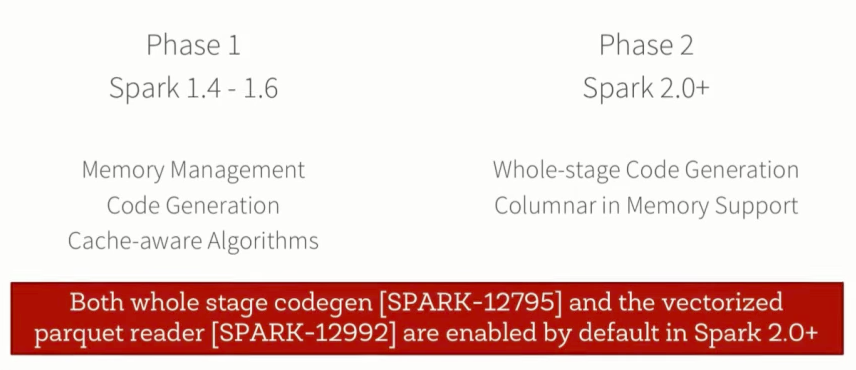
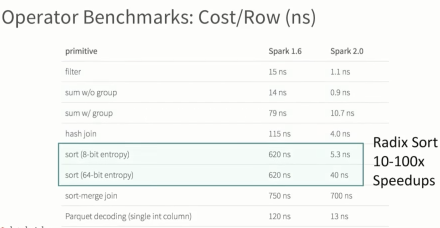

Spark Performance: The Past, Present and Future
===============================================
Video URL : ``https://www.youtube.com/watch?v=RlbBPrWJEEM``


Sameer Agarwal : BlinkDB (should check that out)

#### Hardware Trends

Area    | 2010    | 2016     | Magnitude of Increase
--------|---------|----------|----------------------
Storage | 50+MB/s | 500+MB/s | 10X
Network | 1Gbps   | 10Gps    | 10X
CPU     | ~3Ghz   | ~3Ghz    |  :-(

#### Software Side

* Spark IO had been optimized to prune only take number of things needed
* Parquet and other formats have decreased IO by using "dense" columnar format

so CPU increasingly becomes the bottleneck , not IO

so there was TUNGSTEN

### Project Tungsten Phase 1:
 * perform explicit memory management instead of relying on Java Objects
 * Code generation for expression evaluation
 * Cache conscious sorting

### Phase 2 story begins

 Volcano-An Extensible and Parallel Query Evaluation System

 https://paperhub.s3.amazonaws.com/dace52a42c07f7f8348b08dc2b186061.pdf

 standard for almost 30 years : almost all databases does it

Volcano model very simply is
`` Each operator is an iterator that consumes records from its input operator``

example:

```
class Filter(
  child: Operator,
  predicate: (Row => Boolean)
) extends Operator {

  def next () : Row = {
    val current = child.next()
    while (current == null || predicate(current)) {
      current = child.next()
    }
    return current
  }
}
```
advantages
* implementation are simple to write and add on
* one operator does not need to know what its preceded or followed by as long
   as the model holds


#### But a normal java code is more performant than a volcano model based query engine.

#### 14 million rows / sec  V/s  125 million rows / sec


Volcano Model                                 |  Hand-written Code      
----------------------------------------------|-------------------------
Too many virtual function calls               | No virtual function calls
Intermediate data in memory(or L1/L2/L3 cache)| Data in CPU Registers
cant take advantage of modern CPU features    | Compiler loop unrolling, SIMD, pipelining

Take advantage of all the information that is know after query compilation

SO this leads to Whole-stage code generation

### Whole-stage Code generation

Aim : Fusing operators together so that the generated code looks like hand written
optimized code

So for that we need to :
* Identify chains of operators or stages
* Compile each stage to a single function
* and we still need the general purpose query engine

SO we need the Hand-written code performance with a general query engine capability

```http://www.vldb.org/pvldb/vol4/p539-neumann.pdf```




